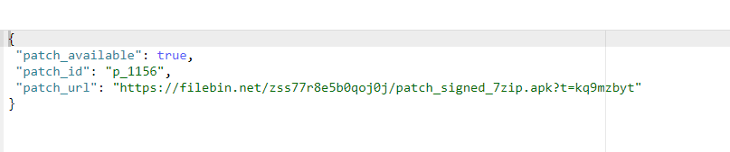

# Tinker_android_hotfix Example
Android Hotfix demo app using Tinker Hotfix solution. we can fix bug, update dex, library and resources without reinstall apk.
Based on config api call
then download patch file from backend server and then apply the patch.

Config mock API response model:
Mock API by using https://www.mockable.io/

Before case- when app has a bug, null exception.

After Hotfix Patch Applied - Bug Fixed 

